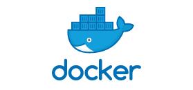

# Tech 201 Containerisation with Docker

## What is Docker?
Docker is a set of platform as a service products that use OS-level virtualisation to deliver software in packages called containers.

## What are Containers?
Containers are a form of operating system virtualisation. A single container might be used to run anything from a small microservice or software process to a larger application. Inside a container are all the necessary executables, binary code, libraries, and configuration files.

### Benefits of containers
- Containers require less system resources than traditional or hardware virtual machine environments because they don't include operating system images.
- Applications running in containers can be deployed easily to multiple different OS and hardware platforms.
- DevOps teams know applications in containers will run the same regardless of where they are deployed.
- Containers allow applications to be more rapidly deployed, patched or scaled.
- Containers support agile and DevOps efforts to accelerate development, test, and production cycles.

## What are Microservices
Simply put a microservice is an independent component of a microservice architecture. 
A microservice architecture is an architectural pattern that arranges an application as a collection of loosely coupled, fine-grained services, communicating through lightweight protocols.

## Why use Docker? What are some of the benfits?
Docker is a popular tool used by several large companies like Paypal, ADP and Spotify, and its adoption by companies continues to grow. Some of the advantages of using Docker includes better return on investment & cost savings, compatibility & maintainability, simplicity, rapid deployment, continuous deployment & testing, multi-cloud platforms and more.
Docker containers share their operating system so they run as isolated processes regardless of the host OS, this means that its containers can run on any computer on any infrastructure and in any cloud. The portability, flexibility and simplicity that this enables is a key reason why Docker is such a powerful tool.

## Containers vs Virtual Machines (VMs)
Although there are some some basic similarities, containers are very different from VMs. VMs run in a hypervisor environment where each VM must include its own guest OS inside it, along with its related binaries, libraries and application files. This consumes a large amount of system resources and overhead, especially when you have multiple VMs running on the same physical server, each with its own guest OS.

In contrast, each container shares the same host OS or system kernel and is much more lightweight. This often means a container may be started much quicker compared to a typical VM. They also reduce the management overhead since they share a common OS, only a single OS needs to be managed.

## Docker Architecture

Docker uses a client-server architecture. The Docker client talks to the Docker daemon, which does the heavy lifting of bulding, running, and distributing your Docker containers. The Docker client and daemon can run on the same system, or you can connect a Docker client to a remote Docker daemon. The Docker client and daemon communicate using a REST API.
### Docker Daemon
The Docker daemon listens for Docker API request and manages Docker objects such as images, containers, networks and volumes. A daemon can also communicate with other daemons to manage Docker services.
### Docker Client
The Docker client is the primary way that many Docker users interact with Docker. When you use commands such as `docker run`, the client sends these commands to the Docker daemon, which carries them out.
### Docker Registry
A Docker registry stores Docker images. Docker Hub is a public registry that anyone can use, and Docker is configured to look for images on Docker Hub by default.

When you use commands such as `docker pull` or `docker run`, the required images are pulled from the Docker registry. When you use the `docker push` command, your image is pushed to the Docker registry.
# Sources
https://en.wikipedia.org/wiki/Docker_(software)

https://www.netapp.com/devops-solutions/what-are-containers/#:~:text=Containers%20are%20a%20form%20of,%2C%20libraries%2C%20and%20configuration%20files.

https://apiumhub.com/tech-blog-barcelona/top-benefits-using-docker/

https://www.netapp.com/blog/containers-vs-vms/

https://docs.docker.com/get-started/overview/#:~:text=Docker%20architecture,to%20a%20remote%20Docker%20daemon.

https://en.wikipedia.org/wiki/Microservices