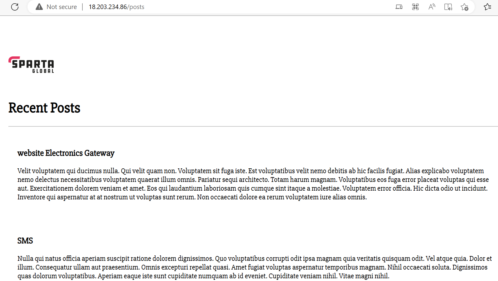

# Docker Guide
This is a guide to using docker

## Docker Installation

For  Windows: https://docs.docker.com/desktop/install/windows-install/

### Linux installation for a server (EC2 Instance) on AWS
If you have an existing older version that you want to remove from your instance.
```
sudo apt-get remove docker docker-engine docker.io
```
Then run
```
curl -fsSL https://get.docker.com -o get-docker.sh
```
Then
```
sudo sh get-docker.sh
```
We can verify that Docker is installed by running
```
docker --version
```
Then start and enable docker
```
sudo systemctl start docker
```
```
sudo systemctl enable docker
```
You are now ready to start using docker on your ec2 instance!

NOTE: you may need to use `sudo` at the beginning of each docker command! 

## Docker commands
```
docker run <image>
```
Will run a docker image. Flags include:
- `d` - detached, this means we can run the command without receiving a log of it being executed
- `p` - port map, here we map our port

In the example below we run a docker image of an Nginx server on our localhost:
```
docker run -d -p 80:80 nginx
```
When we run this and go to our browser we should have our server up and running as shown below
### image of working nginx server

We can check images that are currently running with
```
docker ps
```
And if we want to delete any images
```
docker rm <Container ID> -f
```
The flag `f` means force

To communicate with a container we run the following
```
docker exec -it <Container ID> sh
```
`sh` implies we are communicating via shell

Note a potential blocker may arise, in which case run
```
alias docker="winpty docker"
```
We will know the command has run successfully when we get the `#` prompt which implies we are communicating with the specified container.

If we wish to edit the image, the Nginx server, we navigate to the `index.html` file located in the following directory
```
/usr/share/nginx/html
```
We can start and stop running docker container images via
```
docker start <Container ID>
```
and
```
docker stop <Container ID>
```

### Pushing a container image to Docker Hub
After making a change in a docker container image we need to commit the change before we push to docker hub. We do this by 
```
docker commit <Container ID> <repo name>
```
Then tag the image
```
docker tag <repo name>
```
Then we push
```
docker push <repo name>
```
NOTE: Regarding `<repo name>` this may appear in the format `user/image-name`, here `user` refers to the Docker Hub user name.

### Docker Build
Docker build allows us to build an image from a Dockerfile the command is as shown below:
```
docker build -t <reponame>/<image-name>:<tag> <location>
```
Note that in `<location>` you specify the location of the Dockerfile, if you are executing the command from the same directory as your Dockerfile then the location is denoted as `.`

e.g.
```
docker build -t iwparry/tech201-nginx:v1 .
```
Where the flag `-t` denotes tag (v1 in this case), and we are building this image in the repository `iwparry/tech201-nginx` with tag `v1` on DockerHub, and this command was ran in the same directory as our Dockerfile.

## Launching our custom Nginx website using Dockerfile
In our VS Code what we want to do is launch our custom Nginx server using a Dockerfile. To do this we'll create a folder called docker and inside the folder we will create two files. The first will be `index.html` which will contain the content we want displayed on our website.


Then we want to create a `Dockerfile` to build our image.


We then run the `docker build` command as shown previously, then we can test this on our localhost before pushing to DockerHub (best practice). If we run our new image on port 80 we should see


We have a working Docker image that we can now push to our repo on DockerHub.

## Deploying our app via Dockerfile
Similarly to what we have just done with our web image we can deploy our Nodejs app this time hosted inside a docker container image. An important prerequisite to this is that there is no other existing `Dockerfile` in the same folder, so in our case we created a `nodejs` folder inside our docker folder separate from our first Dockerfile (because we cannot run two Dockerfiles within the same directory) and inside this folder we can create another `Dockerfile` and for our app to work we will need to copy in our `app` folder (the one we used throughout our course).

Once we have satisfied our prerequisites we can write our `Dockerfile` for our Nodejs app.


If everything has been done correctly one we build and run our new image (remember to create a new repo on DockerHub!) we should be able to view our app on our local host on port 3000.


### Downloading dockers documentation to our localhost
Docker has provided us with a way to download their entire documentation to our localhost, accessible even if we aren't connected to the internet.

The command we run to do this is
```
docker run -d -p 4000:4000 docs/docker.github.io
```
Now Docker's documentation is available to view on our localhost via port 4000.

# Launching an App/Mongo Microservice on AWS using Docker Compose

## What is Docker Compose?
Dcoker Compose is a tool for defining and running multi-container Docker applications. With Docker Compose we can use a YAML file to configure our app and database and then create and start both containers uing a single command.

```
docker-compose up
```
Note there is the option to use the flag `-d` at the end of the command to run it detached.

Conversely we can stop all the services of our Docker Compose configuration file by running
```
docker-compose down
```

## Writing our docker-compose.yml file
Below is a snippet of our Docker Compose configuration file that we want to launch both of our app and mongo containers.
 

 Each "service" specified in our yml file refers to a container we want to run, thus we have one container for our database `mongo` and another for our `app`. For this task we decided to use mongo's official image, as for the app we used our Dockerfile from a previous task to build the app container.

 Once we are happy that everything works, we can migrate our directory to an EC2 instance on AWS, we did this via the `scp` command. Once everything has been copied to our EC2 instance we need to install Docker (as shown at the start of the guide) once this is done we need to install Docker Compose in our instance with
 ```
 sudo apt install docker-compose
 ```

 Once this is done we can try to launch our containers using
 ```
 sudo docker-compose up
 ```
Once this has run we can run `sudo docker ps` to check that we have containers running and if so we can check the public IP of our EC2 instance (in this example our IP was 18.203.234.86)

As we can see here our app is working in our EC2 instance


And so is our posts page



### Potential Blockers
- Remember to use `sudo` with every command

- I had an error with a line in my app Dockerfile - specifically `COPY app /usr/src/app/` my folder structure in my localhost had my Dockerfile in my app folder (which works fine) but in my EC2 instance it didn't seem to like it and so I took the Dockerfile outside the app to the same folder level as my `docker-compose.yml` and `app` folder and edit both `Dcokerfile` and `docker-compose.yml` accordingly. So our files look like:


Dockerfile
```
FROM node:12
# label

# Make a directory
WORKDIR /app
# copy data from app folder
#COPY app /usr/src/app/
COPY app/package.json .

# install dependencies npm
RUN npm install

# copy data app folder
COPY app .

# expose port
EXPOSE 3000

# execute required command to start the app
CMD ["npm", "start"]
```
and docker-compose.yml
```
version: "3"
services:
  mongo:
    image: mongo:4.4
    container_name: mongo
    volumes:
      - ./environment/mongod.conf:/etc/mongod.conf
    ports:
      - "27017:27017"

  app:
    container_name: app
    restart: always
    build: .
    ports:
      - "80:3000"
    links:
      - mongo
    environment:
      - DB_HOST=mongodb://mongo:27017/posts
    command: bash -c "node /app/seeds/seed.js && cd /app && npm start"
```