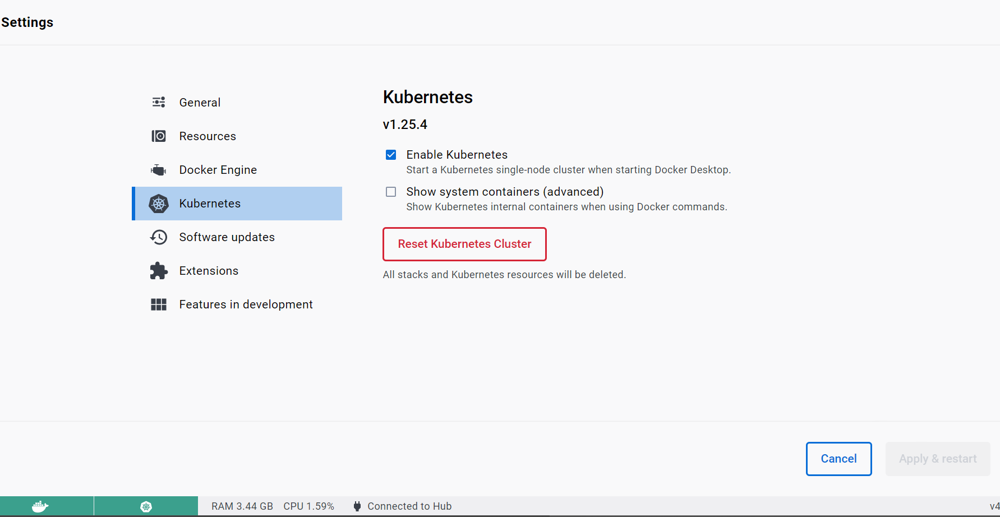
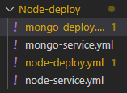
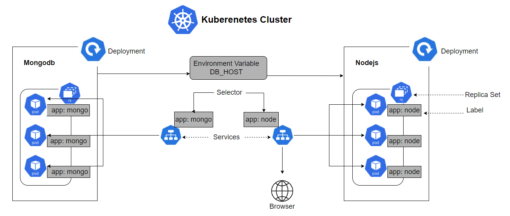
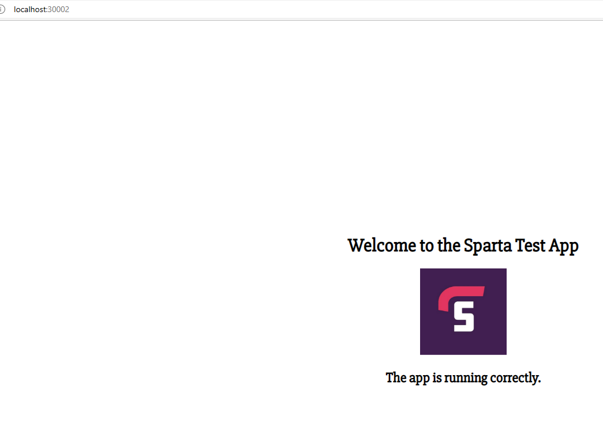
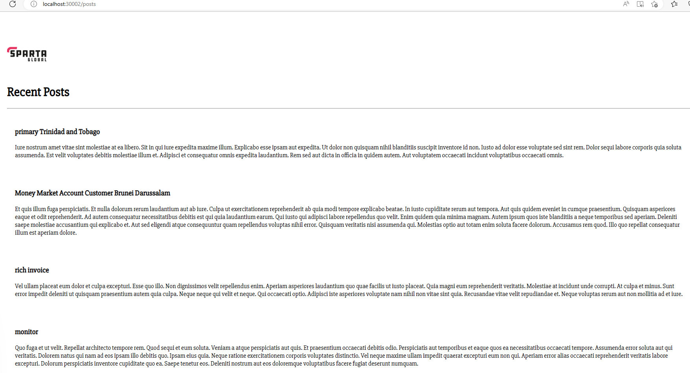

# Tech201 guide to using K8 

To start off we need to ensure that this shows in the settings page of our Docker Desktop (make sure to run as admin).



We want both the Docker and K8 images to be showing in green on the bottom left hand corner of our screen.

We can verify that our K8 is working if we run
```
kubectl get service
```
Note `svc` should also work in this command.

### kubectl commands
If we just input `kubectl` into out terminal we should receive the following output listing all the commands we can run.
```
kubectl controls the Kubernetes cluster manager.

 Find more information at: https://kubernetes.io/docs/reference/kubectl/

Basic Commands (Beginner):
  create          Create a resource from a file or from stdin
  expose          Take a replication controller, service, deployment or pod and expose it as a new Kubernetes service
  run             Run a particular image on the cluster
  set             Set specific features on objects

Basic Commands (Intermediate):
  explain         Get documentation for a resource
  get             Display one or many resources
  edit            Edit a resource on the server
  delete          Delete resources by file names, stdin, resources and names, or by resources and label selector

Deploy Commands:
  rollout         Manage the rollout of a resource
  scale           Set a new size for a deployment, replica set, or replication controller
  autoscale       Auto-scale a deployment, replica set, stateful set, or replication controller

Cluster Management Commands:
  certificate     Modify certificate resources.
  cluster-info    Display cluster information
  top             Display resource (CPU/memory) usage
  cordon          Mark node as unschedulable
  uncordon        Mark node as schedulable
  drain           Drain node in preparation for maintenance
  taint           Update the taints on one or more nodes

Troubleshooting and Debugging Commands:
  describe        Show details of a specific resource or group of resources
  logs            Print the logs for a container in a pod
  attach          Attach to a running container
  exec            Execute a command in a container
  port-forward    Forward one or more local ports to a pod
  proxy           Run a proxy to the Kubernetes API server
  cp              Copy files and directories to and from containers
  auth            Inspect authorization
  debug           Create debugging sessions for troubleshooting workloads and nodes

Advanced Commands:
  diff            Diff the live version against a would-be applied version
  apply           Apply a configuration to a resource by file name or stdin
  patch           Update fields of a resource
  replace         Replace a resource by file name or stdin
  wait            Experimental: Wait for a specific condition on one or many resources
  kustomize       Build a kustomization target from a directory or URL.

Settings Commands:
  label           Update the labels on a resource
  annotate        Update the annotations on a resource
  completion      Output shell completion code for the specified shell (bash, zsh, fish, or powershell)

Other Commands:
  alpha           Commands for features in alpha
  api-resources   Print the supported API resources on the server
  api-versions    Print the supported API versions on the server, in the form of "group/version"
  config          Modify kubeconfig files
  plugin          Provides utilities for interacting with plugins
  version         Print the client and server version information

Usage:
  kubectl [flags] [options]

Use "kubectl <command> --help" for more information about a given command.
Use "kubectl options" for a list of global command-line options (applies to all commands).
```
Viewing a complete list of available objects in a Kubernetes cluster, run `kubectl api-resources` and we will get the following output
```
NAME                              SHORTNAMES   APIVERSION                             NAMESPACED   KIND
bindings                                       v1                                     true         Binding
componentstatuses                 cs           v1                                     false        ComponentStatus
configmaps                        cm           v1                                     true         ConfigMap
endpoints                         ep           v1                                     true         Endpoints
events                            ev           v1                                     true         Event
limitranges                       limits       v1                                     true         LimitRange
namespaces                        ns           v1                                     false        Namespace
nodes                             no           v1                                     false        Node
persistentvolumeclaims            pvc          v1                                     true         PersistentVolumeClaim
persistentvolumes                 pv           v1                                     false        PersistentVolume
pods                              po           v1                                     true         Pod
podtemplates                                   v1                                     true         PodTemplate
replicationcontrollers            rc           v1                                     true         ReplicationController
resourcequotas                    quota        v1                                     true         ResourceQuota
secrets                                        v1                                     true         Secret
serviceaccounts                   sa           v1                                     true         ServiceAccount
services                          svc          v1                                     true         Service
mutatingwebhookconfigurations                  admissionregistration.k8s.io/v1        false        MutatingWebhookConfiguration
validatingwebhookconfigurations                admissionregistration.k8s.io/v1        false        ValidatingWebhookConfiguration
customresourcedefinitions         crd,crds     apiextensions.k8s.io/v1                false        CustomResourceDefinition
apiservices                                    apiregistration.k8s.io/v1              false        APIService
controllerrevisions                            apps/v1                                true         ControllerRevision
daemonsets                        ds           apps/v1                                true         DaemonSet
deployments                       deploy       apps/v1                                true         Deployment
replicasets                       rs           apps/v1                                true         ReplicaSet
statefulsets                      sts          apps/v1                                true         StatefulSet
tokenreviews                                   authentication.k8s.io/v1               false        TokenReview
localsubjectaccessreviews                      authorization.k8s.io/v1                true         LocalSubjectAccessReview
selfsubjectaccessreviews                       authorization.k8s.io/v1                false        SelfSubjectAccessReview
selfsubjectrulesreviews                        authorization.k8s.io/v1                false        SelfSubjectRulesReview
subjectaccessreviews                           authorization.k8s.io/v1                false        SubjectAccessReview
horizontalpodautoscalers          hpa          autoscaling/v2                         true         HorizontalPodAutoscaler
cronjobs                          cj           batch/v1                               true         CronJob
jobs                                           batch/v1                               true         Job
certificatesigningrequests        csr          certificates.k8s.io/v1                 false        CertificateSigningRequest
leases                                         coordination.k8s.io/v1                 true         Lease
endpointslices                                 discovery.k8s.io/v1                    true         EndpointSlice
events                            ev           events.k8s.io/v1                       true         Event
flowschemas                                    flowcontrol.apiserver.k8s.io/v1beta2   false        FlowSchema
prioritylevelconfigurations                    flowcontrol.apiserver.k8s.io/v1beta2   false        PriorityLevelConfiguration
ingressclasses                                 networking.k8s.io/v1                   false        IngressClass
ingresses                         ing          networking.k8s.io/v1                   true         Ingress
networkpolicies                   netpol       networking.k8s.io/v1                   true         NetworkPolicy
runtimeclasses                                 node.k8s.io/v1                         false        RuntimeClass
poddisruptionbudgets              pdb          policy/v1                              true         PodDisruptionBudget
clusterrolebindings                            rbac.authorization.k8s.io/v1           false        ClusterRoleBinding
clusterroles                                   rbac.authorization.k8s.io/v1           false        ClusterRole
rolebindings                                   rbac.authorization.k8s.io/v1           true         RoleBinding
roles                                          rbac.authorization.k8s.io/v1           true         Role
priorityclasses                   pc           scheduling.k8s.io/v1                   false        PriorityClass
csidrivers                                     storage.k8s.io/v1                      false        CSIDriver
csinodes                                       storage.k8s.io/v1                      false        CSINode
csistoragecapacities                           storage.k8s.io/v1                      true         CSIStorageCapacity
storageclasses                    sc           storage.k8s.io/v1                      false        StorageClass
volumeattachments                              storage.k8s.io/v1                      false        VolumeAttachment
```

### Creating a deployment with K8
We can create a K8 deployment with the following command
```
kubectl create -f deployfile.yml
```

Once this has been run we can check that out deployment has been run successfully with the following commands.

```
kubectl get deploy
```
This will show us our deployments and give details such as how many replicas

We can also check our pods with
```
kubectl get pods
```

We can check everything we have running with k8s with the command
```
kubectl get all
```
This will get pods, deployment, services etc.

We can also delete these objects but we will have do define the object that we wish to delete along with its name
```
kubectl delete <object> <object-name>
```
- Here object can be `deploy`, `svc`, `pod` etc.
- Then we need to provide the specific name of the object in question, which we can get by running `kubectl get <object>` to view a list of what we have running for that type of object.

## Nodejs and MongoDB Deployments with K8s
Now that we are using Kubernetes lets create deployments for our app and database!

We are going to write a deployment file each for node and mongo, we also are going to write a service file each node and mongo. All these files will be written in YAML.



Note it is possible to put everything into a single file (separate each file with `---` because YAML) but for clarity we will have a file for each deployment and service.

Below we have a diagram of what we are trying to create



The main components we have touched on so far are the Deployments and Services. 

A **Deployment** is a resource object in K8s that provides declaritive updates to applications. This allows you to describe an application's life cycle, such as which images to use for the app, the number of pods there should be, and the way in which they should be updated.

A **Service** in K8s is a method for enabling network access to a set of pods in K8s.

Some of the other compontents we should touch on are:

**Labels** are key/value pairs that are attached to objects to be identified, such as pods.

**Selector** help us in finding items that have been labelled.

**Pods** are the smallest deployable units of computing that you can create and manage in K8s. These encapsulate one or more containerised applications.

**ReplicaSet** is a K8s object used to maintain a stable set of replicated pods running within a cluster at any given time.

Now that we have touched on the specific components of our cluster we can move on to look at the YAML files we used in creating our Node/Mongo deployment.
### node-deployment.yml
```yml
apiVersion: apps/v1         # which api to use for deployment
kind: Deployment            # what kind of object you want to create

metadata:
  name: node-deployment # naming the object
spec:
  selector:
    matchLabels:
      app: node          # label to be identified by k8s service
  replicas: 3            # Create replicas of this with pods

  template:
    metadata:
      labels:
        app: node        # This label connects to the service or any other 
                         # k8 components

    # Lets define container specifications
    spec:
      containers:
      - name: node
        image: iwparry/tech201-nodejs:v1 # using a Node image we pushed 
                                         # to our DockerHub
        ports:
        - containerPort: 3000    # port for our app

        env:         # our environment variable to connect to DB
        - name: DB_HOST
          value: mongodb://mongo:27017/posts
        lifecycle:
          postStart:
            exec:
              command: ["node", "seeds/seed.js"]  # commands to seed our DB
```
### node-service.yml
```yml
apiVersion: v1 
kind: Service 

metadata:
  name: node-svc
  namespace: default   # Namespaces in K8s provides the scope for Pods, Services, and Deployments in the cluster
spec:
  ports:
  - nodePort: 30002 # The port on each node on which the service is exposed to
    port: 3000

    targetPort: 3000
  selector:
    app: node
  
  type: NodePort
```
Our `mongo-deploy.yml` and `mongo-service.yml` will look similar as seen below
### mongo-deploy.yml
```yml
apiVersion: apps/v1 
kind: Deployment 

metadata:
  name: mongo
spec:
  selector:
    matchLabels:
      app: mongo #  look for this label to match with k8 service
  replicas: 3 # Create replicas of this with pods

  template:
    metadata:
      labels:
        app: mongo

    spec:
      containers:
      - name: mongo
        image: mongo:4.4 # using official mongo image (version 4.4)
        ports:
        - containerPort: 27017
```
### mongo-service.yml
```yml
apiVersion: v1 
kind: Service 
metadata:
  name: mongo
spec:
  selector:
    app: mongo
  ports:
  - port: 27017
    targetPort: 27017
```
Because everything is running withing the same cluster we do not need to edit a mongod.conf file as we have been doing with other tasks, thus our db should be accessible via our app through the environment variable.

So with everything written we can create all this. To have everything work properly I created the mongo deployment and service first and then the app.

We run the files via
```
kubectl create -f <filename>.yml
```
We can then check everything we have running with `kubectl get all`

Once all is running we check our localhost on port `30002`



