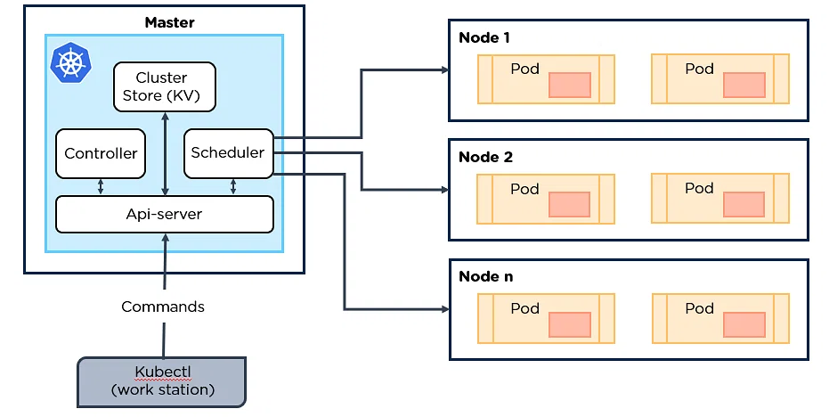

# Kubernetes (K8)
Kubernetes, commonly abbreviated K8s, is an open-source container orchestration system for automating software deployment, scaling and management.

## Kubernetes Architecture
A working Kubernetes deployment is called a cluster. You can visualize a Kubernetes cluster as two parts, the control plane and the nodes.

### What are the key components?
**Control Plane**: This is the container orchestration layer that exposes the API and interfaces to define, deploy and manage the lifecycle of containers. The control plane manages the worker nodes and the pods in the cluster.

**Nodes**: Nodes are Vms or physical servers that host containerised applications. Each node in a cluster can run one or more application instance.

**Image Registry**: Container images are kept in the registry and transferred to nodes by the control plane for execution in container pods.

**Pods**: Pods are where containerised applications run. They can include one or more containers and are the smallest unit of deployment for applications in a Kubernetes cluster.

**Cluster**: A Kubernetes cluster is a set of nodes that run containerised applications.

## Benefits of using Kubernetes
Kubernetes is the fastest growing project in the history of open-source software, after Linux. The increasingly widespread use of Kubernetes among DevOps teams means businesses have a lower learning curve when starting with the platform. Below are some key benefits of Kubernetes giving us insight as to why companies are choosing Kubernetes for all kinds of applications.
1. Container orchestration savings
2. Increased DevOps efficiency for microservice architecture
3. Deploying workloads in multicloud environments
4. More portability with less chance of vendor lock-in
5. Automation of deployment and scalability
6. App stability and availability in a cloud environment
7. Open-source and community-led

# Sources
https://en.wikipedia.org/wiki/Kubernetes

https://www.vmware.com/topics/glossary/content/kubernetes-architecture.html#:~:text=Kubernetes%20is%20an%20architecture%20that,one%20or%20more%20compute%20nodes.

https://www.redhat.com/en/topics/containers/kubernetes-architecture

https://kubernetes.io/docs/concepts/overview/components/

https://www.ibm.com/cloud/blog/top-7-benefits-of-kubernetes